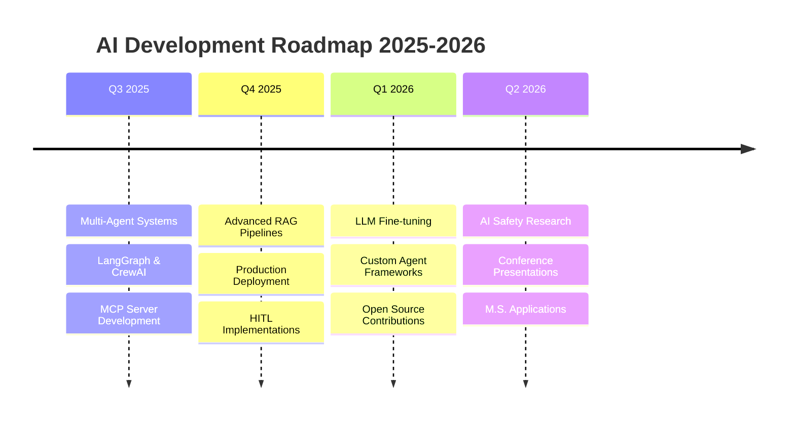

# 🚀 **Hello, World! I'm Nguyen Quang Anh** 👋

  

  

 

  

 

---

## 🎯 **About Me**

> *"Turning complex AI concepts into practical, reliable solutions—one agent at a time."*

I'm a passionate **AI Engineer** and **Information Technology student** at **PTIT**, focused on building intelligent systems that work. My current playground is **Agentic AI**—where I'm exploring multi-agent systems, refining RAG pipelines, and learning to ensure AI behaves responsibly.

🔥 **What I'm up to right now:**
- 🧠 Learning by building collaborative **Multi-Agent Systems** with **LangGraph** and **CrewAI**
- 🔌 Exploring custom **Model Context Protocol (MCP)** servers for secure data access
- 🛡️ Practicing **Human-in-the-Loop (HITL)** guardrails for safe AI deployment
- 📚 Deep-diving into **LLM architectures** and **retrieval optimization**

---

## 🧠 **Areas of Interest**

<table align="center">
  <tr>
    <td align="center" width="33%">
      <h3>🤖 Multi-Agent Systems</h3>
      
Orchestrating specialized agents for collaborative problem-solving using <strong>LangGraph</strong>, <strong>CrewAI</strong>, and <strong>AutoGen</strong>

    </td>
    <td align="center" width="33%">
      <h3>🔌 MCP Architecture</h3>
      
Building custom <strong>Model Context Protocol</strong> servers to connect LLMs with local data, APIs, and tools

    </td>
    <td align="center" width="33%">
      <h3>📚 RAG Optimization</h3>
      
Improving factual accuracy with hybrid search, query rewriting, and advanced reranking techniques

    </td>
  </tr>
  <tr>
    <td align="center">
      <h3>🛡️ Responsible AI</h3>
      
Implementing <strong>HITL</strong> validation, PII filtering, and policy-based guardrails for safe agent behavior

    </td>
    <td align="center">
      <h3>🧪 ML Engineering</h3>
      
End-to-end ML pipelines with <strong>PyTorch</strong>, <strong>TensorFlow</strong>, and production-ready deployment

    </td>
    <td align="center">
      <h3>⚡ Infrastructure</h3>
      
Containerization with <strong>Docker</strong>, CI/CD pipelines, and cloud-native AI deployment

    </td>
  </tr>
</table>

---

## 🛠️ **Technology Stack**

<table align="center">
  <tr>
    <td valign="top" width="33%">
      <h3 align="center">🤖 AI & LLM Frameworks</h3>
      

        
        
        
        
        
        
      

    </td>
    <td valign="top" width="33%">
      <h3 align="center">💾 Databases & Vector Stores</h3>
      

        
        
        
      

    </td>
    <td valign="top" width="33%">
      <h3 align="center">⚙️ DevOps & Tools</h3>
      

        
        
        
        
        
        
      

    </td>
  </tr>
  <tr>
    <td valign="top" width="33%">
      <h3 align="center">📊 Data Science & Analytics</h3>
      

        
        
        
        
      

    </td>
    <td valign="top" width="33%">
      <h3 align="center">💻 Programming Languages</h3>
      

        
        
        
        
      

    </td>
    <td valign="top" width="33%">
      <h3 align="center">☁️ Cloud & Deployment</h3>
      

        
        
        
        
        
      

    </td>
  </tr>
</table>

---

## 📁 **Featured Projects**

<table align="center">
  <tr>
    <td align="center" width="33%">
      <h3>🤖 Multi-Agent MCP System</h3>
      
<em>Exploring cooperative agent communication via Model Context Protocol</em>

      

        
        
        
      

      
📌 <strong>Key Features:</strong> Filesystem coordination, database queries, tool utilization

    </td>
    <td align="center" width="33%">
      <h3>🛡️ HITL Responsible AI Agent</h3>
      
<em>Practicing human-in-the-loop validation and guardrails</em>

      

        
        
        
      

      
📌 <strong>Key Features:</strong> PII filtering, safety checks, confirmation flows

    </td>
    <td align="center" width="33%">
      <h3>⚡ RAG Optimization Sandbox</h3>
      
<em>Currently building parent-document chunking & reranking</em>

      

        
        
        
      

      
📌 <strong>Key Features:</strong> Hybrid search, query rewriting, hallucination reduction

    </td>
  </tr>
</table>

---

## 📊 **GitHub Analytics**

<table align="center">
  <tr>
    <td>
      
    </td>
    <td>
      
    </td>
  </tr>
  <tr>
    <td colspan="2" align="center">
      
    </td>
  </tr>
  <tr>
    <td colspan="2" align="center">
      
    </td>
  </tr>
</table>

---

## 🏆 **Achievements & Certifications**

  <table>
    <tr>
      <td>🏅 <strong>AWS Certified Cloud Practitioner</strong></td>
      <td>📜 <strong>Google IT Automation with Python</strong></td>
      <td>🤖 <strong>Hugging Face - NLP Course</strong></td>
    </tr>
  </table>

---

## 📈 **Current Focus & Roadmap**

 

  

